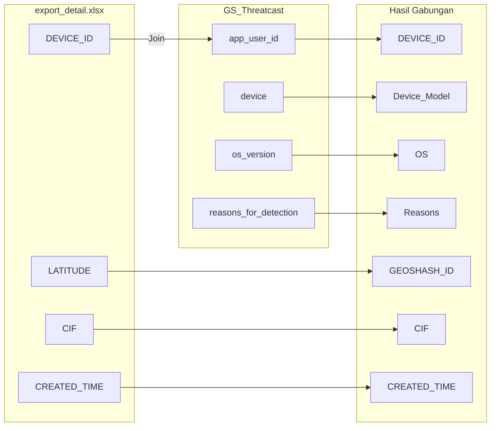

Berikut revisi README **`Risk Grid Guardsquare Dashboard`** berdasarkan analisis dan rekomendasi sebelumnya, dengan bahasa yang lebih profesional, konsisten, dan lengkap:

---

# 📍 Risk Grid Guardsquare Dashboard

## 📘 Penjelasan Komprehensif

### 🎯 Tujuan Utama

Dashboard ini dirancang untuk **menggabungkan dan memvisualisasikan data risiko perangkat** berdasarkan informasi dari sistem **Threatcast (GS)** dan data aktivitas pengguna dari sistem **onboarding (export\_detail.xlsx)**.

Tujuannya adalah untuk:

* Mengidentifikasi perangkat berisiko secara spasial.
* Menganalisis hubungan antara perangkat, lokasi, dan aktivitas nasabah.
* Memberikan insight audit dan investigasi.

---

## 🔗 Mekanisme Penggabungan Data

Proses pencocokan dilakukan berdasarkan kolom berikut:

```python
gs["app_user_id"] == export_detail["DEVICE_ID"]
```

### ✅ Data yang Digabungkan

**Dari `export_detail.xlsx`:**

* `DEVICE_ID`
* `LATITUDE`, `LONGITUDE`
* `CIF`, `CREATED_TIME`
* `Region`, `SCENARIO`
* `TEMPORARY_USER_STATUS`

**Dari `GS (Threatcast)`:**

* `device` (Device Model)
* `os_version` (OS)
* `reasons_for_detection` (Deteksi risiko)

---

## 🔄 Proses Transformasi Tambahan

1. **Agregasi Lokasi** menggunakan:

   * `GEOSHASH_ID` (pengganti `GRID_ID`) → representasi spasial lokasi dalam bentuk string.
   * Tingkat presisi geohash disesuaikan untuk clustering risiko.

2. **Klasifikasi Risiko (Heuristik)**:

   * `FaceAttack`: Serangan wajah.
   * `DeviceSharing`: Perangkat digunakan oleh banyak CIF.
   * `Mass/Cluster`: Banyak CIF & perangkat pada satu lokasi.
   * `Normal`: Tidak terindikasi anomali.

3. **Geocoding Wilayah**:

   * Menggunakan [Nominatim](https://nominatim.openstreetmap.org/) + cache lokal.
   * Diterapkan untuk pengisian otomatis kolom `Region`.

4. **Pewarnaan Risiko** berdasarkan skor atau klasifikasi:

   * Geohash blok divisualisasikan dengan layer warna.

---

## 📂 Output Utama

* `hasil_grid_detail.xlsx` → Data granular per perangkat & nasabah.
* `hasil_grid_agg.xlsx` → Ringkasan risiko per `GEOSHASH_ID` (bukan lagi per `GRID_ID`).

---

## 🚀 Fitur Aplikasi Dashboard

| Fitur                             | Penjelasan                                                     |
| --------------------------------- | -------------------------------------------------------------- |
| 🗺️ **Peta Interaktif**           | Menampilkan titik lokasi perangkat berdasarkan lat/lon.        |
| 🟦 **Visualisasi Geohash Block**  | Layer warna berdasarkan `GEOSHASH_ID` dan level risiko.        |
| 📌 **Ringkasan Statistik**        | Total geohash, jumlah risiko tinggi, perangkat unik, dsb.      |
| 📍 **Presisi Nasabah/Device**     | Pop-up detail berdasarkan perangkat dan aktivitas.             |
| 🧠 **Cluster Detection (DBSCAN)** | Deteksi konsentrasi risiko berdasarkan spasial.                |
| 🔍 **Filter Dinamis**             | Berdasarkan `Region`, tanggal, dan klasifikasi risiko.         |
| 📤 **Ekspor Data**                | Data hasil filter dapat diunduh dalam format `.xlsx` / `.csv`. |

---

## 🧱 Struktur Proyek

```
risk-grid-dashboard/
├── risk_grid.py                       # Script preprocessing dan transformasi
├── dashboard.py                      # Streamlit UI interaktif
├── hasil_grid_detail.xlsx            # Output detail nasabah & perangkat
├── hasil_grid_agg.xlsx               # Output ringkasan per geohash
├── export_detail.xlsx                # Data aktivitas perangkat
├── Data Excel GS Feb 25.xlsx         # Data Threatcast (GS)
└── README.md                         # Dokumentasi ini
```

---

## ⚙️ Instalasi & Eksekusi

### 1. Clone Repositori

```bash
git clone https://github.com/yourusername/risk-grid-dashboard.git
cd risk-grid-dashboard
```

### 2. Install Dependencies

```bash
pip install -r requirements.txt
```

### 3. Siapkan Data Excel

Tempatkan file berikut di root folder:

* `Data Excel GS Feb 25.xlsx`
* `export_detail.xlsx`

### 4. Jalankan Proses Preprocessing

```bash
python risk_grid.py
```

Akan menghasilkan:

* `hasil_grid_detail.xlsx`
* `hasil_grid_agg.xlsx`

### 5. Jalankan Dashboard

```bash
streamlit run dashboard.py
```

---

## 🗂️ requirements.txt

```
streamlit
pandas
folium
streamlit-folium
scikit-learn
tqdm
geopy
pygeohash
openpyxl
xlsxwriter
numpy
```

---

## 🔄 Diagram Alur Pencocokan



---

## 📌 Catatan

* Data lokasi menggunakan **GEOSHASH** dengan presisi tertentu agar fleksibel dalam analisis spasial.
* **File input/output tidak dibagikan publik** karena bersifat sensitif.
* Cocok digunakan untuk **tim fraud, keamanan TI, dan analis risiko**.

---

## 👤 Pengembang

* ERM (Enterprise Risk Management)
* Kontributor: MDI (Data Intelligence)

---

## ⚖️ Lisensi

Repositori ini bersifat **open-source untuk penggunaan internal dan riset**. Mohon digunakan secara etis dan sesuai ketentuan keamanan data.

---

Jika kamu ingin saya bantu membuatkan versi bahasa Inggris atau integrasi langsung ke dalam `README.md`, tinggal beri tahu saja.
